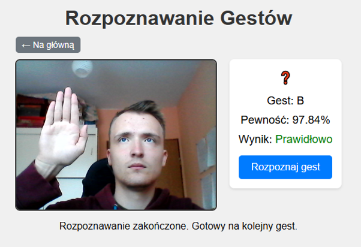

# (PL) gesture-recognition

**Webowy system rozpoznawania gestów polskiego alfabetu palcowego (PJM)**

Aplikacja webowa umożliwiająca użytkownikom naukę i sprawdzanie znajomości 36 gestów polskiego alfabetu migowego (PJM). Po zalogowaniu użytkownik wybiera literę, wykonuje gest przed kamerą, a system w czasie rzeczywistym rozpoznaje go za pomocą modelu LSTM i porównuje z oczekiwaną literą. Po opanowaniu wszystkich gestów można pobrać certyfikat PDF.

---

## Struktura projektu

```
gesture-recognition/
├── static/                  # pliki statyczne aplikacji webowej
│   ├── videos/              # przykładowe wideo gestów (.webp)
│   ├── favicon.ico          # ikona strony
│   ├── index.html           # strona główna z kartami liter
│   ├── recognize.html       # strona rozpoznawania gestu
│   ├── login.html           # strona logowania
│   ├── register.html        # strona rejestracji
│   └── style.css            # style CSS
├── model.h5                 # wytrenowany model LSTM
├── server.py                # główny serwer (HTTP + WebSocket + auth + SQLite)
├── requirements.txt         # lista zależności
└── README.md
```

---

## Wymagania

- Python **3.10.11** (zalecana wersja)
- Kamera internetowa
- Przeglądarka z obsługą WebSocket i getUserMedia (Chrome, Edge, Firefox)
- Windows OS

---

## Jak uruchomić (krok po kroku)

### 1. Utwórz i aktywuj wirtualne środowisko (jeśli jeszcze nie istnieje)

```bash
python -m venv venv
venv\Scripts\activate
```

### 2. Zainstaluj wymagane biblioteki

```bash
pip install --upgrade pip
pip install -r requirements.txt
```

### 3. Uruchom serwer aplikacji

```bash
python server.py
```

- Serwer uruchamia się na porcie **8000**
- Otwórz w przeglądarce: [http://localhost:8000](http://localhost:8000)

---

## Korzystanie z aplikacji

1. Zarejestruj się na stronie `/register.html`
2. Zaloguj się na `/login.html`
3. Na stronie głównej wybierz literę (kartę)
4. Na stronie rozpoznawania:
   - Automatycznie otwiera się okno z przykładowym wideo gestu
   - Naciśnij **Rozpoznaj gest**
   - Wykonaj gest przed kamerą
   - Wynik: **„Prawidłowo"** (zielony) lub **„Nieprawidłowo"** (czerwony)
5. Po rozpoznaniu wszystkich 36 liter aktywuje się przycisk **Pobierz certyfikat**

---



---

# (ENG) gesture-recognition

**Web-based Polish fingerspelling alphabet (PJM) gesture recognition system**

A web application that allows users to learn and test their knowledge of 36 Polish Sign Language (PJM) gestures. After logging in, the user selects a letter, performs the gesture in front of the camera, and the system recognizes it in real time using an LSTM model and compares it with the expected letter. Once all gestures are mastered, the user can download a PDF certificate.

---

## Project Structure

```
gesture-recognition/
├── static/                  # static web application files
│   ├── videos/              # sample gesture videos (.webp)
│   ├── favicon.ico          # site icon
│   ├── index.html           # main page with letter cards
│   ├── recognize.html       # gesture recognition page
│   ├── login.html           # login page
│   ├── register.html        # registration page
│   └── style.css            # CSS styles
├── model.h5                 # trained LSTM model
├── server.py                # main server (HTTP + WebSocket + auth + SQLite)
├── requirements.txt         # list of dependencies
└── README.md
```

---

## Requirements

- Python **3.10.11** (recommended version)
- Webcam
- Browser with WebSocket and getUserMedia support (Chrome, Edge, Firefox)
- Windows OS

---

## How to Run (step by step)

### 1. Create and activate a virtual environment (if it does not exist yet)

```bash
python -m venv venv
venv\Scripts\activate
```

### 2. Install the required libraries

```bash
pip install --upgrade pip
pip install -r requirements.txt
```

### 3. Start the application server

```bash
python server.py
```

- The server starts on port **8000**
- Open in your browser: [http://localhost:8000](http://localhost:8000)

---

## Using the Application

1. Register at `/register.html`
2. Log in at `/login.html`
3. On the main page, select a letter (card)
4. On the recognition page:
   - A window with a sample gesture video opens automatically
   - Click **Recognize gesture**
   - Perform the gesture in front of the camera
   - Result: **"Correct"** (green) or **"Incorrect"** (red)
5. After recognizing all 36 letters, the **Download Certificate** button becomes active
