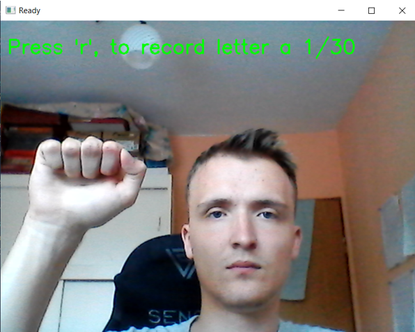

# (PL) sign-gesture-lstm

Skrypty dla trenowania modelu do rozpoznawania gestów dłoni oraz ich wykrywanie w czasie rzeczywistym z użyciem kamery internetowej.
Model oparty jest na sieci neuronowej LSTM i wykorzystuje punkty kluczowe dłoni (hand landmarks).

---

## Wymagania

- Python **3.10.11**
- Kamera internetowa
- System Windows (instrukcje poniżej dla Windows)

---

## Instalacja i uruchomienie

### 1️⃣ Jeśli tworzysz środowisko od zera

Utwórz wirtualne środowisko:

```bash
python -m venv venv
```

Aktywuj środowisko:

```bash
venv\Scripts\activate
```

Zainstaluj wymagane biblioteki:

```bash
pip install -r requirements.txt
```

### 2️⃣ Jeśli środowisko już istnieje

Aktywuj je:

```bash
venv\Scripts\activate
```

---

## Proces trenowania modelu

### 🔹 1. Zbieranie danych

Uruchom:

```bash
python collect_data.py
```

Skrypt zapisuje sekwencje punktów dłoni do folderu `data/`.

### 🔹 2. Trenowanie modelu

```bash
python train_model.py
```

Po zakończeniu treningu zostanie wygenerowany plik modelu (np. `model.h5`).

### 🔹 3. Rozpoznawanie gestów w czasie rzeczywistym

```bash
python detect_live.py
```

Program uruchamia kamerę i wyświetla przewidywaną literę alfabetu PJM.

### 🔹 4. Ewaluacja modelu (średnia skuteczność)

Aby sprawdzić dokładność modelu:

```bash
python evaluate_model.py
```

Skrypt wyświetli:

- dokładność (accuracy)
- macierz pomyłek (confusion matrix)
- inne metryki klasyfikacji

---

## Struktura

```
├── data/                # Zebrane dane (sekwencje punktów dłoni)
├── model.h5             # Wytrenowany model
├── collect_data.py      # Zbieranie danych
├── train_model.py       # Trenowanie modelu
├── detect_live.py       # Rozpoznawanie w czasie rzeczywistym
├── evaluate_model.py    # Ewaluacja modelu
├── requirements.txt     # Lista zależności
└── README.md
```

---

## Informacje dodatkowe

- Model wykorzystuje sekwencje punktów kluczowych dłoni (21 landmarków).
- Sieć LSTM analizuje zależności czasowe w ruchu dłoni.
- Skuteczność modelu zależy od jakości i liczby zebranych danych.

---



---

# (ENG) sign-gesture-lstm

Scripts for training a hand gesture recognition model and real-time detection using a webcam.
The model is based on an LSTM neural network and uses hand landmarks as input features.

---

## Requirements

- Python **3.10.11**
- Webcam
- Windows OS (instructions below for Windows)

---

## Installation and Setup

### 1️⃣ If you are creating the environment from scratch

Create a virtual environment:

```bash
python -m venv venv
```

Activate the environment:

```bash
venv\Scripts\activate
```

Install the required libraries:

```bash
pip install -r requirements.txt
```

### 2️⃣ If the environment already exists

Activate it:

```bash
venv\Scripts\activate
```

---

## Model Training Process

### 🔹 1. Data Collection

Run:

```bash
python collect_data.py
```

The script saves hand landmark sequences to the `data/` folder.

### 🔹 2. Model Training

```bash
python train_model.py
```

After training is complete, a model file will be generated (e.g. `model.h5`).

### 🔹 3. Real-Time Gesture Recognition

```bash
python detect_live.py
```

The program launches the camera and displays the predicted letter of the PJM alphabet.

### 🔹 4. Model Evaluation (average accuracy)

To check model accuracy:

```bash
python evaluate_model.py
```

The script will display:

- accuracy
- confusion matrix
- other classification metrics

---

## Project Structure

```
├── data/                # Collected data (hand landmark sequences)
├── model.h5             # Trained model
├── collect_data.py      # Data collection
├── train_model.py       # Model training
├── detect_live.py       # Real-time recognition
├── evaluate_model.py    # Model evaluation
├── requirements.txt     # List of dependencies
└── README.md
```

---

## Additional Information

- The model uses hand landmark sequences (21 landmarks).
- The LSTM network analyzes temporal dependencies in hand movement.
- Model accuracy depends on the quality and quantity of collected data.
